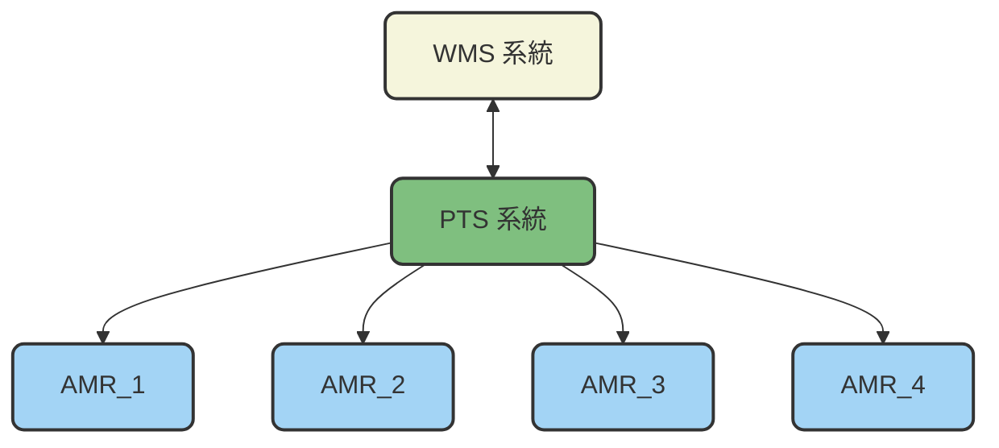
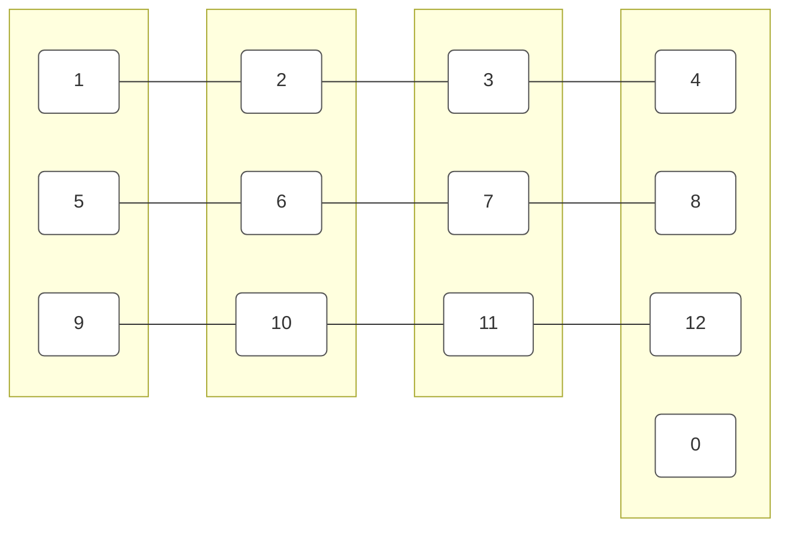

# 八德場區場內運行規劃書

## 0. 版本管理
|版本 | 更新| 編制者 |
|:------|:------|:------|
| v1.0.0　新建| 2025-10-07 |Athena |

## 1. 總覽

本規格書定義AMR接受WMS派遣任務派送到達指定位置，人員在每一個停靠站將藥品放入，完成操作後於AMR 上按下按鈕往下一站，等訂單內物料都齊後，WMS 會派AMR 到包裝區等整個場區的運行規劃。

 

- **WMS Server**：倉儲管理系統伺服器。
- **PTS Client**：規劃與運輸系統端。

  - **系統架構圖：**

## 2. 操作規格

### 2.1 場域配置圖

本場域共設置有12個工作站點以及一個充電站點，如下示意圖所示。 
1、5、9 為包裝區站點，同時也是AMR 的待命區，其餘點位為撿貨區站點。0 為充電站 。

 

### 2.2 運行規劃

(1) 共有4台AMR 正常模式下，3台AMR 在工作區，1台AMR 在充電區待命。 
(2) 在充電站的AMR 狀態顯示為：unavailable，無法接受派遣任務。 
(3) 每天要派遣任務時，須確認AMR1、AMR2、AMR3 是否分別在待命區1、5、9，且AMR狀態是待命中，方可開始派遣任務。 
    如果AMR 不在待命區，請人員手動移動到待命區。 
(3) 

