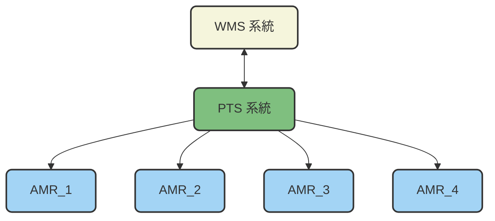

# 八德場區場內運行規劃書

## 0. 版本管理
|版本 | 更新| 編制者 |
|:------|:------|:------|
| v1.0.0　新建| 2025-10-07 |Athena |

## 1. 總覽

本規格書定義PTS接受WMS派遣任務派送到達指定位置，人員在每一個停靠站將藥品放入，完成操作後於AMR 上按下按鈕往下一站，等訂單內物料都齊後，AMR 回到包裝區後等待下一趟派遣，整個場區的運行規劃。

 

- **WMS Server**：倉儲管理系統伺服器。
- **PTS Client**：規劃與運輸系統端。

  - **系統架構圖：**

## 2. 操作規格

### 2.1 場域配置圖

本場域共設置有12個工作站點以及一個充電站點，請參考附圖1所示。 
站點 1、5、9 為包裝區，同時也是AMR 的待命區，其餘點位為撿貨區站點。0 為充電站 。（站點編號會依照實際情況調整 ）

 

### 2.2 運行規劃

(1) 共有4台AMR 正常模式下，3台AMR 在工作區，1台AMR 在充電區待命。 
(2) 在充電站的AMR 狀態顯示為：充電中，無法接受派遣任務。 
(3) 每天要派遣任務時，須確認AMR1、AMR2、AMR3 是否分別在待命區1、5、9，且AMR狀態是待命中，方可開始派遣任務。如果AMR 不在待命區，請人員手動移動到待命區。 
(4) AMR在執行當趟任務過程中，變成低電量，會完成當趟任務後再去充電。此時會自主把充電站的AMR4和須充電的車子進行交換，交換期間可能會影響其他台的工作效率。 
(5) PTS收到來自於WMS 的指令通知為下班模式，AMR將啟動輪流充電計畫。 
(6) PTS收到來自於WMS 的指令通知為加班模式，且4台AMR 電量均非低電量情況下，允許4台車子同時工作，將會把在充電站的車子，狀態調整為待命中，並在原地等待派遣任務。若收到加班模式的指令但有車子是低電量的情況下，會拒絕進入加班模式。 
(7) 加班模式進行中，若此時有一台車處於低電量狀態，加班模式會強制變回一般工作模式，並且把低電量的車子派回去充電。 
(8) 加班模式完成後或者強制切回正常模式時，WMS仍須把指令通知為下班模式，才會啟動輪流充電計畫。 

 

### 2.3 任務派遣流程

(1) WMS將單趟任務指派給AMR1，任務內容 : 1 --> 2 --> 3 --> 4 --> 7--> 8 --> 1 (詳細派遣方式請參考規劃與運輸系統和倉儲管理系統HTTPS 通訊規格書 )。 
(2) AMR1 從站點1 走到站點2 停止，人員將物品放到AMR的架子上，並在人機界面上按下確認。 
(3) AMR1 繼續由站2 走到站3停止，人員將物品放到AMR的架子上，並在人機界面上按下確認，如此往復直到回到站點1。 
(4) 人員將所有物品從架上取走，並在AMR人機界面上按下確認後，整趟任務完成。 
(5) AMR1狀態將從工作中，切換為待命中，可接受下一趟任務派遣。 

## 3. 附圖1
