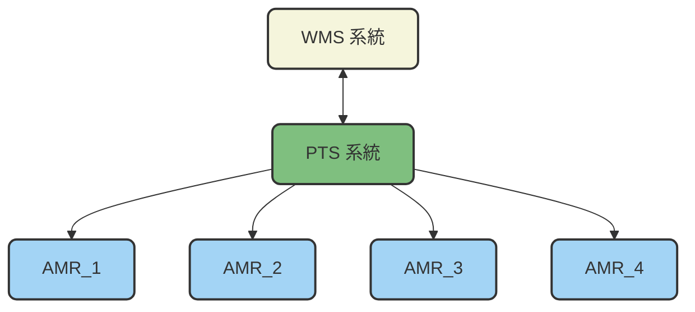
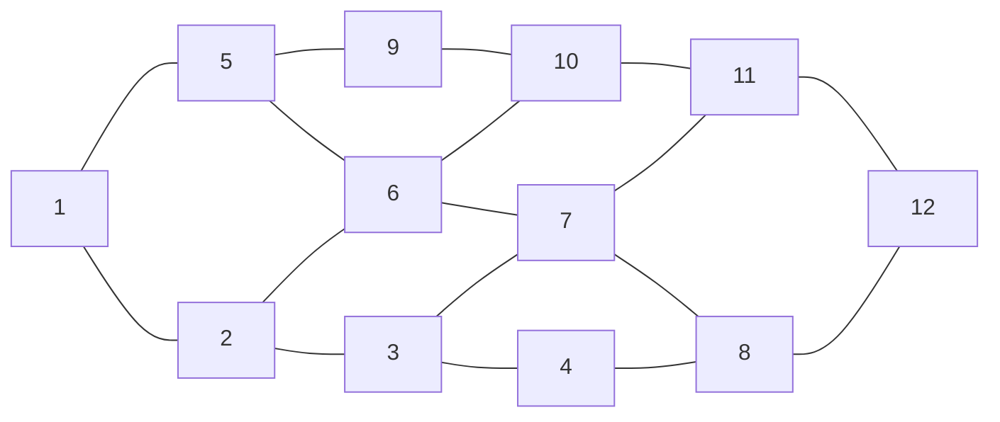

# 八德場區場內運行規劃書

## 0. 版本管理
|版本 | 更新| 編制者 |
|:------|:------|:------|
| v1.0.0　新建| 2025-10-07 |Athena |

## 1. 總覽

本規格書定義AMR接受WMS派遣任務派送到達指定位置，人員在每一個停靠站將藥品放入，完成操作後於AMR 上按下按鈕往下一站，等訂單內物料都齊後，WMS 會派AMR 到包裝區等整個場區的運行規劃。

 

- **WMS Server**：倉儲管理系統伺服器。
- **PTS Client**：規劃與運輸系統端。

  - **系統架構圖：**

## 2. 操作規格

2.1 本場域共設置有12個工作站點以及一個充電站點。
2.2 共有4台AMR 會在本廠域內運行，正常模式下，3台AMR 在工作區，1台AMR 在充電區待命。
2.3 

